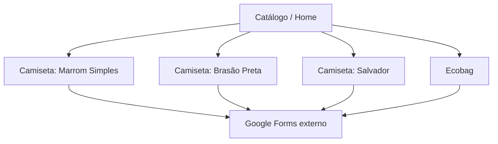
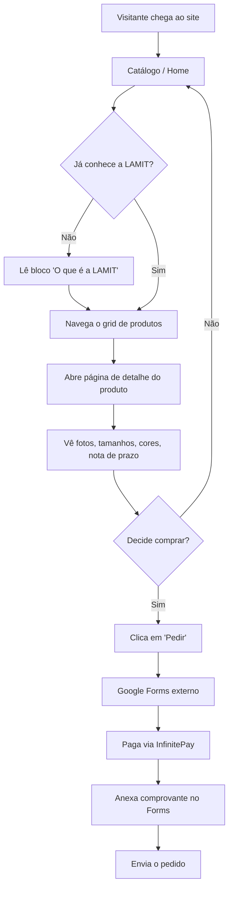

# lamit-store UI/UX Specification

Este documento define os objetivos de experiência do usuário, a arquitetura de informação, os fluxos de usuário e as especificações de design visual para a interface da **lamit-store**. Serve como base para o design visual e desenvolvimento front-end, garantindo uma experiência coesa e centrada no usuário.

## Overall UX Goals & Principles

### Target User Personas

- **Comunidade e seguidores da LAMIT:** 18–30 anos, universitários interessados em tecnologia/inovação, já seguem a LAMIT nas redes. Querem uma forma tangível de mostrar pertencimento.
- **Visitante orgânico sem contexto prévio:** chega sem saber o que é a LAMIT. Precisa entender a marca rápido pra decidir se compra.

### Usability Goals

- **Clareza imediata:** em poucos segundos de rolagem, o visitante entende que é a loja oficial de produtos LAMIT e o que está disponível.
- **Decisão informada sem fricção:** tamanho, cor e prazo de entrega estão visíveis antes do clique em "Pedir" — ninguém chega ao Forms surpreso.
- **Confiança sem alarme:** a nota de prazo de entrega (FR4) informa sem soar como aviso de risco.
- **Sem becos sem saída:** todo caminho de navegação (catálogo → detalhe → CTA) é óbvio, sem exigir que o usuário "descubra" como comprar.

### Design Principles

1. **Marca antes de template** — cada tela deve parecer genuinamente LAMIT (scrapbook/colagem/editorial), nunca uma loja genérica com logo colado.
2. **Transparência sem alarme** — informação sensível (prazo, produção sob demanda) é clara mas não é tratada como aviso de erro.
3. **Contexto para quem não conhece** — a página nunca assume que o visitante já sabe o que é a LAMIT.
4. **Simplicidade funcional** — sem elementos de e-commerce que o MVP não tem (carrinho, conta, filtros) só por convenção de categoria.
5. **Mobile em primeiro lugar, de verdade** — decisões de layout partem do celular, não são adaptações de desktop.

### Change Log

| Date | Version | Description | Author |
|------|---------|-------------|--------|
| 2026-08-13 | 0.1 | Front-end spec inicial criado a partir do PRD (`docs/prd.md`) | Uma (@ux-design-expert) |

## Information Architecture (IA)

### Site Map / Screen Inventory

A camiseta "Salvador" é 1 modelo com 3 variações de cor (azul, dourada, preta) — não 3 páginas separadas, consistente com "3 modelos de camiseta" do PRD.

### Navigation Structure

**Navegação Primária:** nenhuma barra de navegação tradicional é necessária — o site é um catálogo de página única (home) com 4 produtos; o próprio grid é a navegação principal.

**Navegação Secundária:** cada página de produto tem um link "Voltar ao catálogo" para retornar à home.

**Estratégia de Breadcrumb:** breadcrumb mínimo (Catálogo > Nome do Produto) nas páginas de detalhe.

## User Flows

### Fluxo: Descobrir a LAMIT e Pedir um Produto

**User Goal:** Encontrar um produto do drop, entender tamanho/cor/prazo de entrega, e chegar ao Google Forms pronto para finalizar o pedido.

**Entry Points:** Link direto das redes sociais da LAMIT, busca, ou link compartilhado por terceiros.

**Success Criteria:** O usuário envia o pedido no Google Forms com o produto/variação corretos em mente e o comprovante de pagamento (InfinitePay) já anexado.

#### Flow Diagram

#### Edge Cases & Error Handling:

- Foto do produto ainda não disponível (caso da ecobag) → placeholder claro, nunca imagem quebrada ou espaço vazio.
- Preço ainda não definido pelos fornecedores → produto exibido com nota "preço em breve" em vez de campo vazio ou "R$ --".
- Link do Google Forms ainda não configurado no momento do lançamento → o CTA não deve apontar pra um link quebrado silenciosamente.
- Usuário chega direto numa página de produto via link compartilhado, sem passar pela home → a página de detalhe também precisa de contexto mínimo da marca.

**Notes:** Pagamento e anexo de comprovante acontecem inteiramente dentro do Google Forms, fora do controle de design do site — mas a página de produto deve deixar claro, antes do clique em "Pedir", que essas etapas vão acontecer.

## Wireframes & Mockups

**Primary Design Files:** N/A — não há Figma/Sketch neste projeto. O design será construído diretamente em código (HTML/CSS) via Impeccable, sem arquivo de design intermediário. Esta seção define os layouts conceituais em texto.

### Catálogo / Home

**Purpose:** Apresentar a marca minimamente e os 4 produtos do drop, incentivando o clique em um deles.

**Key Elements:**
- Header com logo LAMIT
- Bloco compacto "O que é a LAMIT" (1–2 frases + logo, não um parágrafo institucional)
- Grid de produtos (4 cards: foto, nome, categoria)
- Footer com nota de privacidade (FR8)

**Interaction Notes:** cada card do grid é clicável e leva à página de detalhe; grid em 1 coluna no mobile, 2+ colunas no desktop. O bloco de contexto é dimensionado para que o início do grid já fique parcialmente visível na mesma tela sem rolar — atendendo tanto quem já conhece a marca (pula direto pro grid) quanto quem não conhece (lê o contexto sem esforço).

**Design File Reference:** N/A.

### Página de Detalhe de Produto

**Purpose:** Dar toda a informação necessária para a decisão de compra e levar ao CTA externo.

**Key Elements:**
- Breadcrumb "Catálogo > Nome do Produto"
- Galeria de fotos do produto (ou placeholder)
- Nome, descrição, tamanhos e cores disponíveis
- Nota de prazo de entrega (FR4) — logo após a descrição principal, não destacada como alerta
- CTA "Pedir" (leva ao Google Forms)
- Footer com nota de privacidade

**Interaction Notes:** o CTA "Pedir" fica visível sem rolagem excessiva (logo após nome/preço), para quem já decidiu comprar. A nota de prazo de entrega fica imediatamente após a descrição principal, com rolagem mínima — nunca enterrada no rodapé da página, para não repetir o risco de confiança já identificado no PRD.

**Design File Reference:** N/A.

## Component Library / Design System

**Design System Approach:** Sistema novo e mínimo, construído junto com o site (não há design system prévio da LAMIT para produtos digitais — só a identidade de marca institucional). Dado o tamanho do projeto (5 telas), o objetivo é um punhado de componentes reutilizáveis, não uma biblioteca completa de atomic design.

### Product Card

**Purpose:** Representar um produto no grid do catálogo.

**Variants:** nenhuma variante estrutural — mesmo layout para os 4 produtos.

**States:** normal; placeholder (quando a foto ainda não existe, caso da ecobag).

**Usage Guidelines:** sempre clicável (leva à página de detalhe); foto, nome e categoria são obrigatórios; preço é opcional/condicional (nota "preço em breve" quando ausente).

### CTA Button ("Pedir")

**Purpose:** Ação principal de conversão — redireciona ao Google Forms.

**Variants:** apenas 1 (é a única ação primária do site; não há CTAs secundários concorrentes).

**States:** normal; (opcional) desabilitado/aguardando, se o link do Forms ainda não estiver configurado no momento do deploy.

**Usage Guidelines:** sempre visível sem rolagem excessiva na página de produto; nunca deve levar a um link quebrado silenciosamente.

### Delivery Note (Nota de Prazo)

**Purpose:** Comunicar o modelo de produção sob demanda (FR4) de forma transparente.

**Variants:** nenhuma — texto padrão com os dados do produto interpolados (janela de pedidos, prazo de produção).

**States:** único estado — informativo, nunca de alerta/erro visualmente.

**Usage Guidelines:** sempre parte da descrição do produto, nunca como banner ou modal.

### Site Footer

**Purpose:** Nota de privacidade (FR8) e navegação de retorno, presente em todas as páginas.

**Variants:** nenhuma.

**States:** único.

**Usage Guidelines:** compartilhado entre catálogo e páginas de produto — construir uma vez, reutilizar.

## Branding & Style Guide

**Visual Identity:** guia de marca oficial em `assets/lamit-brand-skill/lamit-brand/references/lamit-institucional.md` — vinculante, não uma sugestão.

### Color Palette

| Color Type | Hex Code | Usage |
|---|---|---|
| Primary | `#0A69C4` (azul institucional) | Tecnologia, confiança, comunidade — links, títulos, elementos estruturais de destaque |
| Secondary | `#0E1B27` (navy quase preto) | Texto principal sobre fundo claro |
| Accent | `#E8722C` (laranja) | CTA "Pedir" e pontos de ação — usar com moderação, conforme o guia |
| Success | N/A | O site não tem estados de confirmação próprios (sucesso acontece no Forms, fora do site) |
| Warning | N/A | O site não tem validação de formulário própria |
| Error | N/A | Idem — sem formulários nativos no MVP |
| Neutral | `#FBFAF8` (cream) + `#0E1B27` | Fundos de card, texto, bordas |

*Success/Warning/Error marcados N/A porque o guia de marca não define cores pra esses estados e o MVP não tem fluxos internos que os produzam.*

### Typography

O guia de marca descreve a linguagem visual (editorial/scrapbook, títulos grandes, hierarquia forte, muito espaço negativo) mas não especifica famílias tipográficas exatas. Family e escala ficam como decisão aberta para a fase de build (`new-work` do Impeccable).

### Iconography

Sem biblioteca de ícones formal definida no guia. O guia pede elementos gráficos manuais (setas desenhadas, estrelas, sublinhados, rabiscos) em vez de ícones de sistema genéricos.

### Spacing & Layout

O guia não define um grid/escala de espaçamento numérica — só o princípio de "muito espaço negativo, composição limpa, contraste forte". Grid e escala específicos ficam para a fase de build.

## Accessibility Requirements

**Compliance Target:** WCAG AA *(suposição registrada no PRD — piso razoável para um site público, não confirmado explicitamente)*

### Key Requirements

**Visual:**
- Contraste de cor: mínimo 4.5:1 para texto normal, 3:1 para texto grande. Atenção especial ao laranja (`#E8722C`) — pode não passar em contraste para texto pequeno; usar só em elementos grandes/CTA.
- Indicadores de foco: todo elemento interativo precisa de indicador de foco visível ao navegar por teclado.
- Tamanho de texto: unidades relativas, redimensionável sem quebrar o layout.

**Interaction:**
- Navegação por teclado: todo o fluxo deve ser 100% operável via teclado.
- Suporte a leitor de tela: fotos de produto com texto alternativo descritivo; CTA "Pedir" anuncia claramente pra onde leva.
- Alvos de toque: cards e CTAs com área mínima de 44×44px.

**Content:**
- Texto alternativo: obrigatório em todas as fotos de produto, descrevendo a peça de verdade.
- Estrutura de headings: hierarquia lógica (1 H1 por página, H2 para seções), sem pular níveis.
- Rótulos de formulário: N/A — o site não tem formulário próprio.

### Testing Strategy

Validação manual com navegação por teclado (tab through) e leitor de tela básico (VoiceOver/NVDA) antes do lançamento, mais verificação automática de contraste (Lighthouse/axe) nas cores principais da marca.

## Responsiveness Strategy

### Breakpoints

| Breakpoint | Min Width | Max Width | Target Devices |
|---|---|---|---|
| Mobile | 0px | 599px | Smartphones |
| Tablet | 600px | 1023px | Tablets, laptops pequenos |
| Desktop | 1024px | 1439px | Laptops/desktops comuns |
| Wide | 1440px | — | Monitores grandes |

### Adaptation Patterns

**Layout Changes:** grid de produtos em 1 coluna no mobile → 2 colunas no tablet → 3–4 colunas no desktop/wide.

**Navigation Changes:** mínimas — breadcrumb e link "voltar ao catálogo" iguais em todos os tamanhos.

**Content Priority:** no mobile, foto do produto e CTA "Pedir" têm prioridade visual logo no topo; a nota de prazo continua visível com rolagem mínima. No desktop, mais espaço permite ver galeria, descrição e nota de prazo mais próximos entre si.

**Interaction Changes:** alvos de toque de 44×44px no mobile; hover nos cards do catálogo só existe como reforço em desktop/mouse — nunca como única indicação de que o card é clicável.

## Animation & Micro-interactions

**Motion Principles:** movimento usado com moderação, só para reforçar a sensação "tátil/artesanal" da marca — sutil, rápido, nunca atrasando a ação do usuário. Deve respeitar `prefers-reduced-motion`.

### Key Animations

- **Hover no Product Card:** leve elevação/inclinação sutil, como pegar um recorte de papel. (Duration: 150–200ms, Easing: ease-out)
- **Transição catálogo → detalhe:** fade/slide sutil entre páginas. (Duration: 200ms, Easing: ease-in-out)
- **Feedback de clique no CTA "Pedir":** resposta rápida de toque antes do redirecionamento externo. (Duration: 100ms, Easing: ease-out)

## Performance Considerations

### Performance Goals

- **Page Load:** carregamento completo (LCP) abaixo de ~2.5s em conexão 4G mediana — alinhado ao NFR4 do PRD.
- **Interaction Response:** resposta a cliques/toques abaixo de 100ms.
- **Animation FPS:** 60fps nas animações definidas.

### Design Strategies

- Imagens de produto otimizadas/comprimidas (WebP quando possível), carregadas em dimensões adequadas ao breakpoint.
- Sem frameworks JS pesados — decisão de stack já confirmada.
- Fontes (quando escolhidas na fase de build) carregadas com `font-display: swap`.
- CSS/JS mínimos, sem bibliotecas de animação externas.

## Next Steps

### Immediate Actions

1. Salvar este documento em `docs/front-end-spec.md` (concluído).
2. Confirmar com o usuário as suposições registradas: bloco "O que é a LAMIT" como seção da home (não página separada), WCAG AA como nível de acessibilidade, "Salvador" tratado como 1 produto com 3 variações de cor.
3. Escolher tipografia, ícones e escala de espaçamento na fase de build (`new-work` do Impeccable), já que o guia de marca da LAMIT não define esses detalhes.
4. Handoff para `@architect` criar a arquitetura front-end.

### Design Handoff Checklist

- [x] Todos os fluxos de usuário documentados
- [x] Inventário de componentes completo
- [x] Requisitos de acessibilidade definidos
- [x] Estratégia responsiva clara
- [x] Diretrizes de marca incorporadas
- [x] Metas de performance estabelecidas

## Checklist Results

Nenhum checklist desta skill se aplica neste estágio: os disponíveis (`pattern-audit-checklist`, `component-quality-checklist`, `accessibility-wcag-checklist`, `migration-readiness-checklist`) auditam código/componentes já construídos ou migrações — não uma especificação de UX pré-build como esta. Rodar `accessibility-wcag-checklist` faz mais sentido depois que o site existir (fase `audit` do Impeccable, ou `*a11y-check` desta agente).
